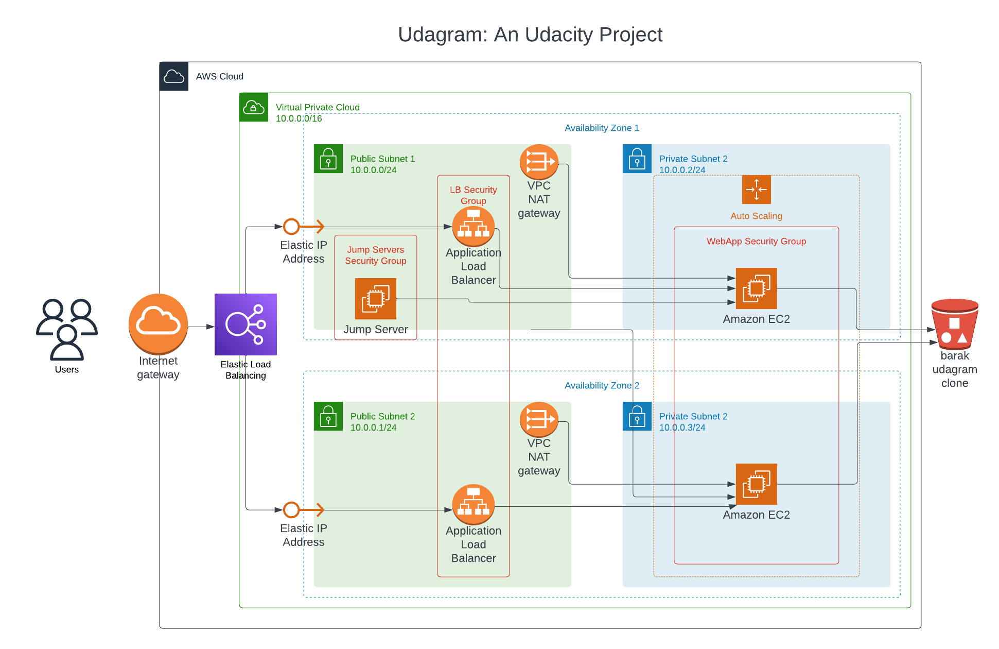
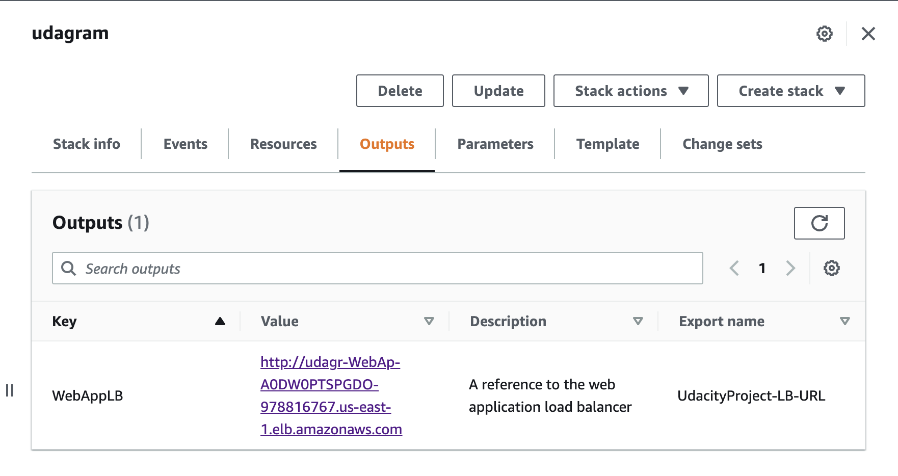
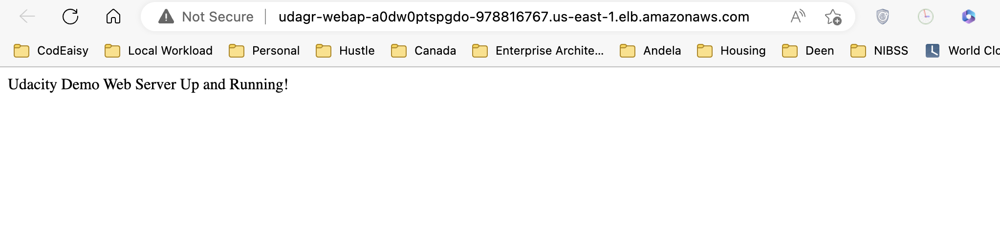

# Udacity Cloud DevOps Nanodegree

## Project 2: Udagram Clone

### Pictures

Please find below my submission for the Udagram clone project

#### Figure 1 (Architectural Diagram)



#### Figure 2 (Important CloudFormation Outputs)



#### Figure 3 (Running application in browser)



### How to reproduce

#### Create/Update required network infrastructure

```[bash]
./network-script-create.sh stack-name aws-region
# feel free to change the region to your own preferred region e.g
# ./network-script-create.sh udagram-network us-east-1
```

```[bash]
./network-script-update.sh stack-name aws-region, please use the same region used in create
# feel free to change the region to your own preferred region e.g
# ./network-script-update.sh udagram-network us-east-1
```

#### Create/Update application servers and other resources

```[bash]
./app-script-create.sh stack-name aws-region
# feel free to change the region to your own preferred region e.g
# ./app-script-create.sh udagram-clone us-east-1
```

```[bash]
./app-script-update.sh stack-name aws-region, please use the same region used in create
# feel free to change the region to your own preferred region e.g
# ./app-script-update.sh udagram-clone us-east-1
```

Thank you.
