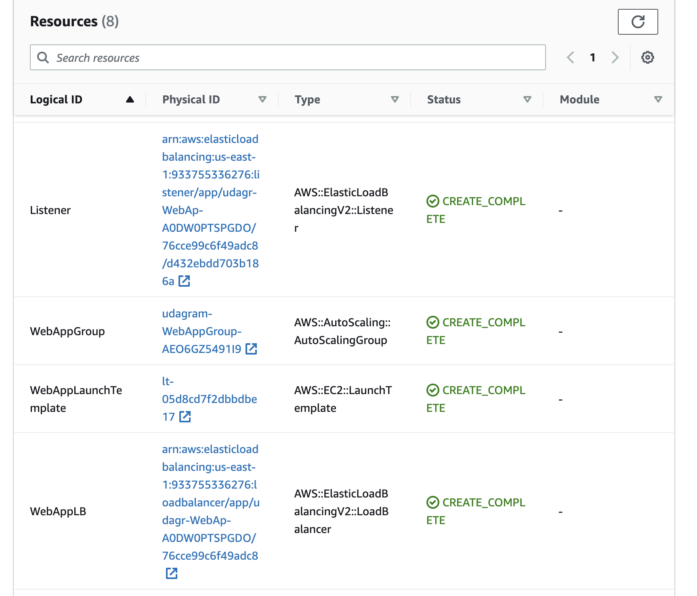

# Udacity Cloud DevOps Nanodegree

## Project 2: Udagram Clone

### Pictures

Please find below my submission for the Udagram clone project

#### Figure 1 (Architectural Diagram)


Click [here](https://lucid.app/lucidchart/b37016e2-4658-4cef-b3fa-16a7d26fbaef/edit?invitationId=inv_bab64bf9-765c-43ac-99bc-26cb0b6c3d45) to see actual file on Lucid Chart

#### Figure 2 (Important CloudFormation Outputs)


#### Figure 3 (Running application in browser)


#### Figures 4(a-c) (All resources)





### How to reproduce

#### Create/Update required network infrastructure

```[bash]
./network/network-script-create.sh stack-name aws-region
# feel free to change the region to your own preferred region e.g
# ./network/network-script-create.sh udagram-network us-east-1
```

```[bash]
./network/network-script-update.sh stack-name aws-region, please use the same region used in create
# feel free to change the region to your own preferred region e.g
# ./network/network-script-update.sh udagram-network us-east-1
```

#### Create/Update application servers and other resources

```[bash]
./app-script-create.sh stack-name aws-region
# feel free to change the region to your own preferred region e.g
# ./app-script-create.sh udagram-clone us-east-1
```

```[bash]
./app-script-update.sh stack-name aws-region, please use the same region used in create
# feel free to change the region to your own preferred region e.g
# ./app-script-update.sh udagram-clone us-east-1
```

#### Optional - Create/Update jump servers

```[bash]
./jump-server/jump-script-create.sh stack-name aws-region
# feel free to change the region to your own preferred region e.g
# ./jump-server/jump-script-create.sh udagram-clone us-east-1
```

```[bash]
./jump-server/jump-script-update.sh stack-name aws-region, please use the same region used in create
# feel free to change the region to your own preferred region e.g
# ./jump-server/jump-script-update.sh udagram-clone us-east-1
```

Thank you.
